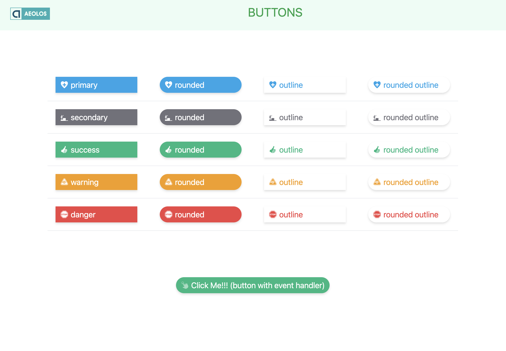

# React Button Component

A react button component to produce buttons with styling and event handling. There are pre-coded button style which you can easy change or add your own style using any CSS library or custom file.

Instant of use the classic `<button></button>` HTML element you can use the React `<Button></Button>`. Your engineers can use this component and add any styling or event to the button with no problem as all the them are passing to the component as props.

<br>



<br>

## Packages & Dependencies

The component using the following packages:

- [Tailswindcss](https://tailwindcss.com/docs/installation)
- [npm classnames](https://www.npmjs.com/package/classnames)
- [React Icons](https://react-icons.github.io/react-icons/)

<br>

## The Component

Download or copy & paste the code of the Button.js file

<br>

## How To Use It

Install the dependencies and packages.

```console
npm install react-icons
npm install classnames
npm install tailwindcss
```

Add the @tailwind directives for each of Tailwind’s layers to your main CSS file.

```css
@tailwind base;
@tailwind components;
@tailwind utilities;
```

Inside the file you want to use the component ex. `ButtonPage.js` add the following code:

```jsx
import { GiClick } from 'react-icons/gi';
import Button from './Button';

// In case you want to use an event handler
const handleClick = () => {
  alert('You clicked the button');
};

<Button className="m-5" onClick={handleClick}>
  <GiClick />
  Click Me!!! (button with event handler)
</Button>;
```

<br>

## The button style

Apart from the className where you can add any css style from Tailwindcss or a custom file you can add the following that they passed as props to the Button component:

- Button type: primary, secondary, success, warning, danger. Only one of these can be used at a time otherwise we get an error on the console.
- Button style: rounded, outline or rounded outline.
- There is some hover pre-coded styling as well

**_see the attached example App.js file_**
